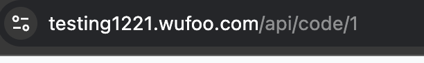
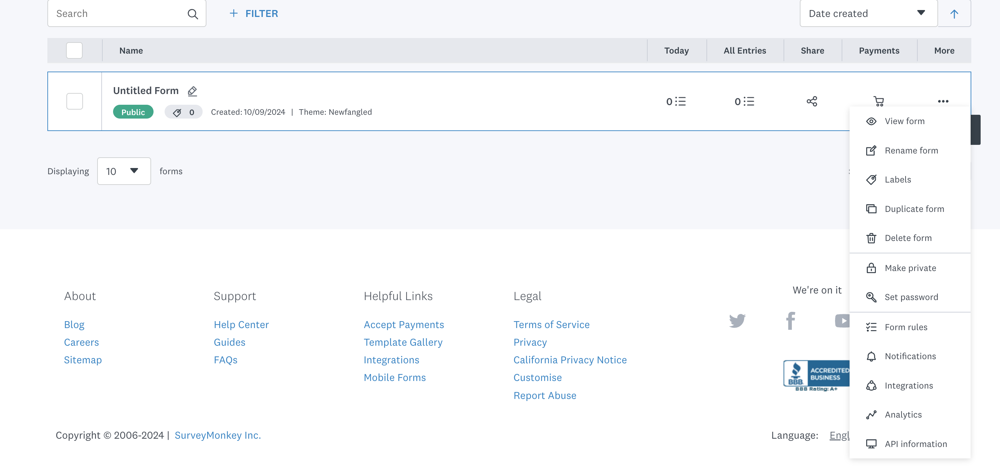
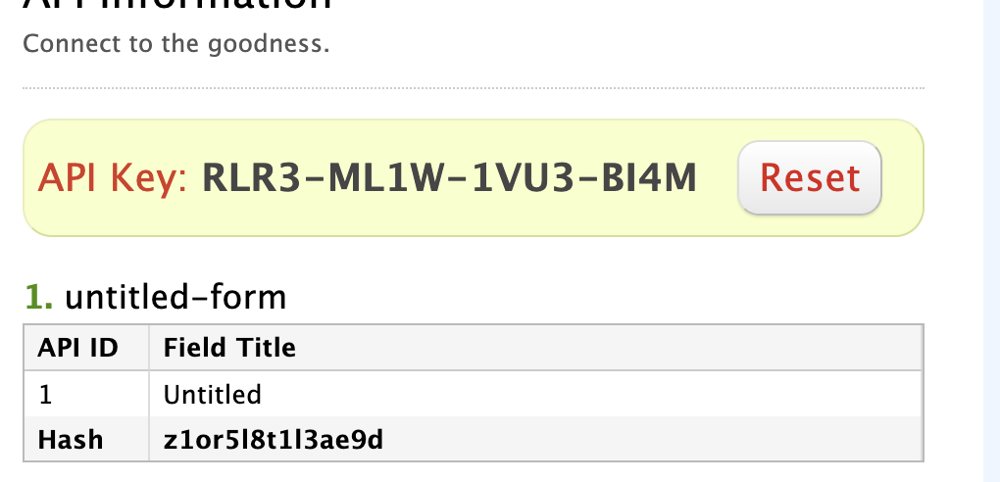
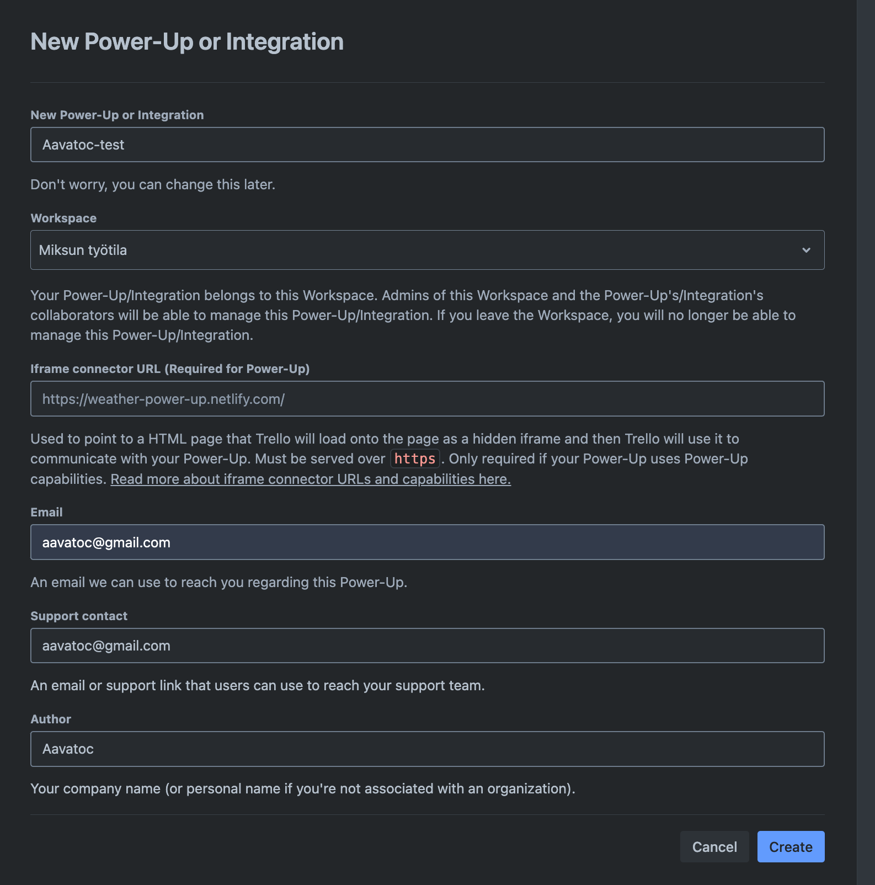
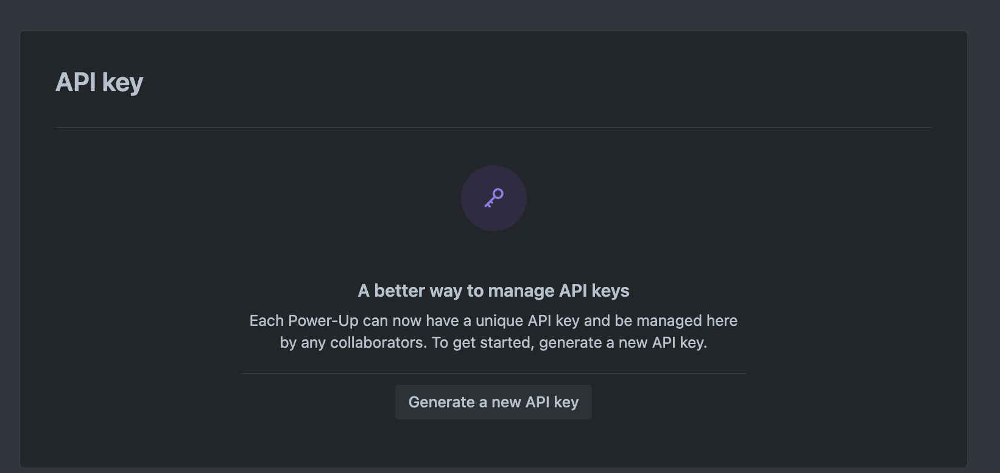
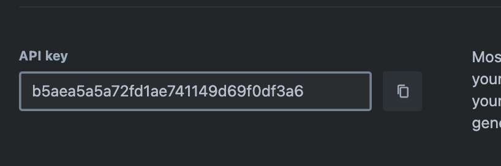
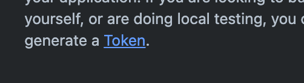
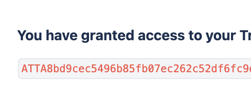
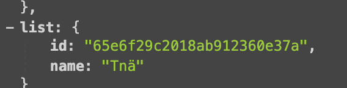

# Wufooo to Trello integration

This is a simple integration of bringing certain form data from Wufoo entries to Trello

This is made to suite the needs of a certain project. Feel free to use it for your needs.

### Requirements

- Python3.12
- python-dotenv
- requests

The script is made in macOs and works also with ubuntu. If using in NT / Windows environment, the path operations might bring you some headaches, but I haven't tested it.

### Usage

Create a venv
``python3 -m venv venv``

Activate the env
``source ./venv/bin/activate``

- Using windows probably something like ``.\venv\scripts\activate`` or similar

Install dependencies
``python3 -m venv pip install -r requirements.txt```

Create env

- Create an env file. You can rename the .env.example to .env and get the env-vars (below)

### Env vars

**API_WUFOO, BASE_URL_ORGANIZATION and WUFOO_FORM_HASH**

Your ``BASE_URL_ORGANIZATION``will be the text preceding ".wufoo.com". In my case, testing 1221



Click on the API information on the three dot menu to get the info



You can get the ``API_KEY_WUFOO`` and the form hash on the bottom (``WUFOO_FORM_HASH``) from this page. NB! Keep the key safe, this will grant access to the form to anyone who has the key.



**API_TRELLO and TOKEN_TRELLO**

Navigate to https://trello.com/power-ups/admin

Create a new integration (Fill in the details, you can leave the iframe connector url empty as we're not using it)



Click on the "Generate a new API key" button



Copy the API_key, set it as the ``API_KEY_TRELLO``



Generate a token by clicking there



Copy the token and store it as ``TOKEN_TRELLO``

NB! Lose this, and you'll boards are compromised. Probably better using OAuth as per user basis. Pay attention to GDPR as well, as this enables you to view all the data on the boards.



**LIST_ID_TRELLO**

This is not the most optimal way, but *a one way to do it.*

To get the LIST_ID_TRELLO, you'll have to navigate to your trello board and add '.json' to the end of the url like this


Then you'll have to crawl through the data to find the list id, like below there is a notation on a card of a list called "Tnä" with its id. Crab the id as your ``LIST_ID_TRELLO``.


